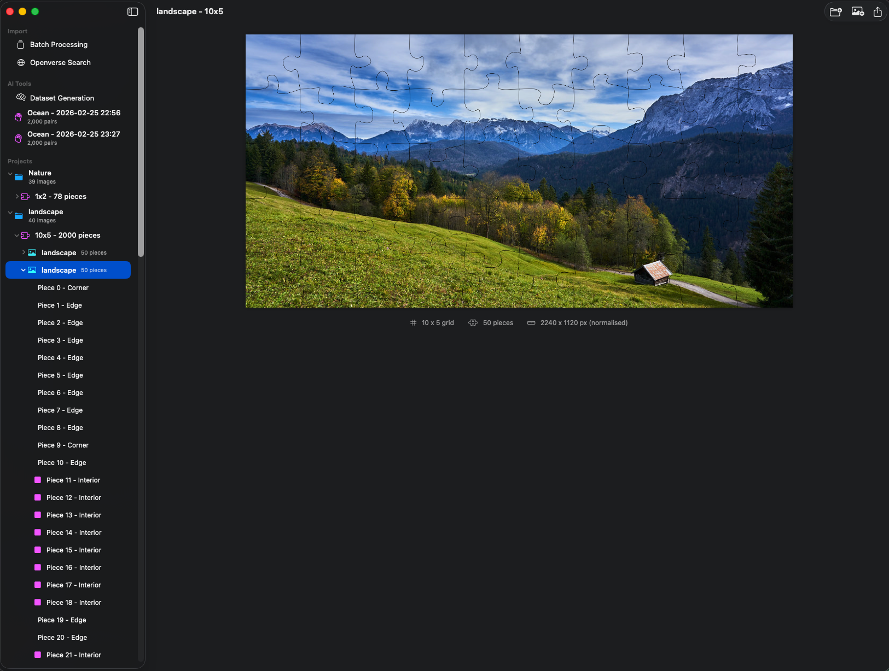
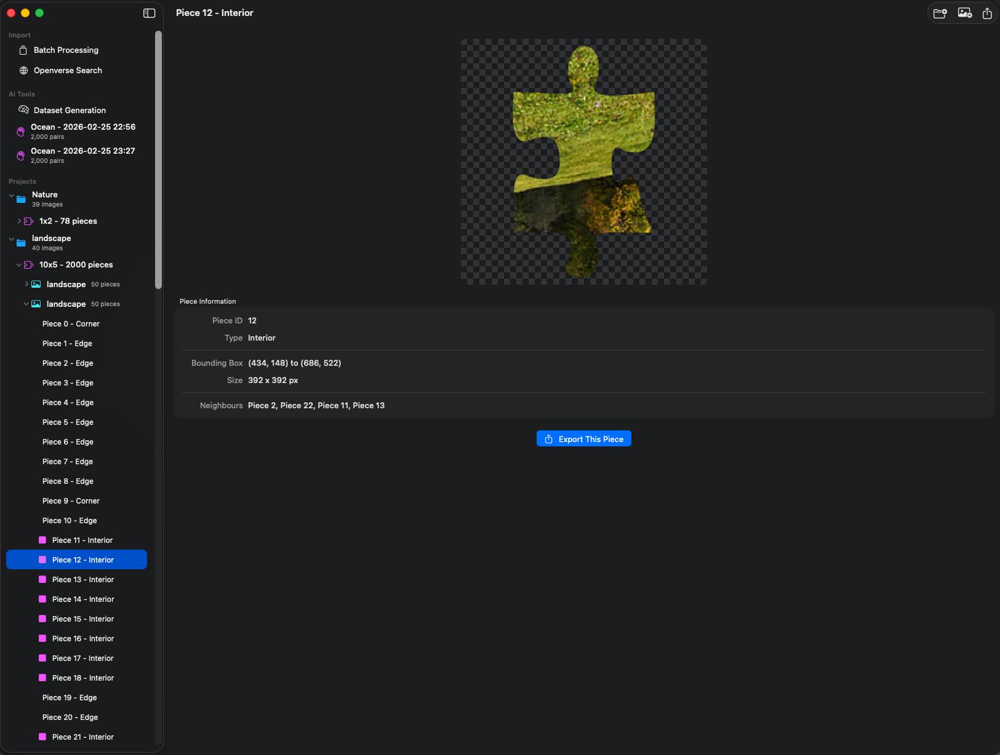
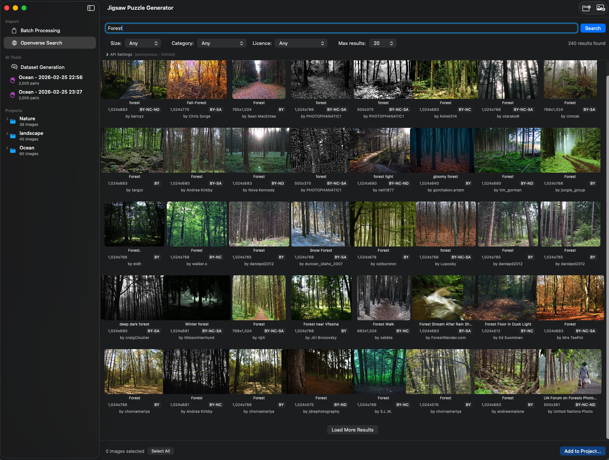
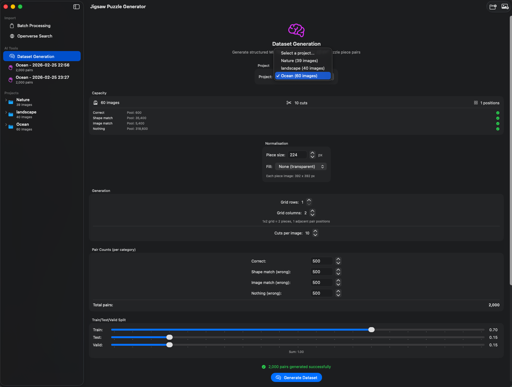
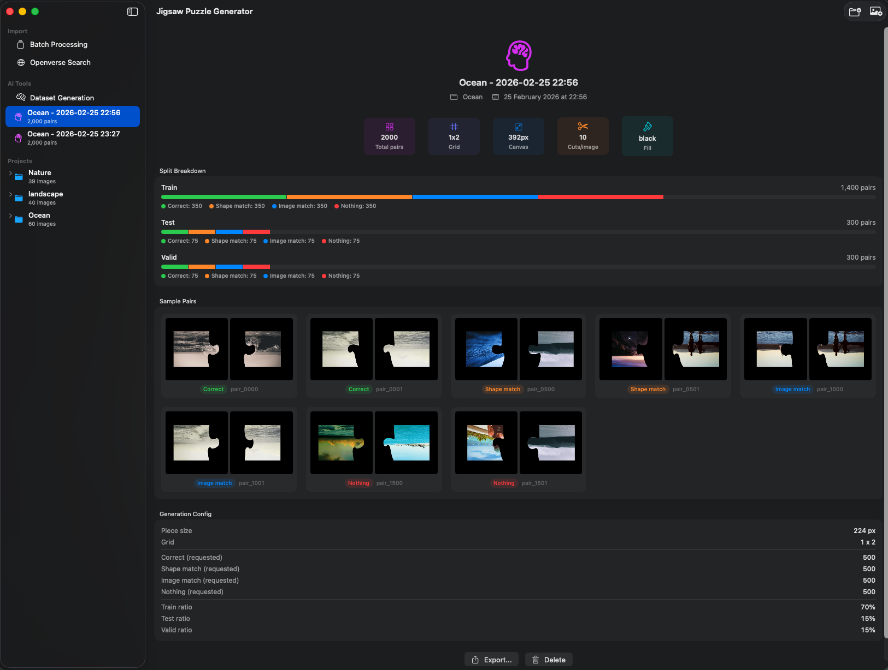

# Jigsaw Puzzle Generator

A native macOS app that generates realistic jigsaw puzzle pieces from any image. Built entirely with Swift and SwiftUI - no external dependencies.

## Features

### Puzzle Generation

Import any image and split it into interlocking jigsaw pieces with natural-looking tabs and blanks. Each piece is saved as a transparent PNG with precise bezier curve edges that interlock perfectly with their neighbours.



- **Configurable grid size** from 2 pieces up to 100x100 (10,000 pieces)
- **Realistic shapes** generated using cubic bezier curves with randomised control points
- **Perfect interlocking** - adjacent pieces share the same edge curve, one traversed forward and the other reversed
- **Transparent PNGs** - each piece is clipped from the source image with anti-aliased edges and saved to disk
- **Cut lines overlay** - visualise the puzzle grid on top of the source image



### Project Organisation

Group multiple images into projects. Each project can have multiple "cuts" (puzzle generations) with different grid sizes, letting you experiment with different configurations without losing previous results.

- **Project > Cut > Image > Pieces** hierarchy in the sidebar
- **Multiple cuts per project** - try 5x5, 10x10, and 20x20 on the same images
- **Persistent storage** - projects, images, and generated pieces survive app restarts
- **Source images preserved** - originals are copied into the project and never modified

### AI Normalisation

An optional pipeline that produces uniform-dimension pieces ideal for machine learning training data. When enabled:

1. The source image is **centre-cropped** to match the grid's aspect ratio (cols:rows)
2. **Resized** to exact pixel dimensions (cols x pieceSize by rows x pieceSize)
3. Pieces are **generated normally** with interlocking bezier edges
4. Every piece is **padded to a uniform square canvas** with a configurable background fill

All pieces across all images end up at identical pixel dimensions - critical for batch processing in neural networks.

- **Piece size**: 32 to 1024 pixels per grid cell (default 224, matching common vision model input sizes)
- **Fill options**: transparent, black, white, or average grey computed from the source image
- **Deterministic canvas size** - guaranteed identical dimensions across different images, even with different random edge shapes
- **Normalised source preview** - the cut detail view shows the cropped/resized source so it matches the piece grid exactly

### Openverse Image Search

Search and download Creative Commons licensed images directly from [Openverse](https://openverse.org) (the open media search engine powering WordPress) without leaving the app.



- **Search filters**: size (small/medium/large), category (photograph/illustration/digitised artwork), licence type (commercial use/allows modification/all CC)
- **Adjustable results**: fetch 20 to 500 results per search
- **Bulk selection** - select multiple images and download them all into a project at once
- **Attribution preserved** - licence and creator information flows through from Openverse to the exported metadata JSON
- **API credentials** (optional) - configure OAuth2 client credentials in the settings panel for higher rate limits. Without credentials, the app works in anonymous mode (100 requests/day, 5/hour)

### Batch Processing

Process multiple images at once with a single configuration. Select local files or drag and drop, then generate puzzles for all of them in one go.

- **Per-image and overall progress** tracking
- **Skip/fail handling** - images that are too small or fail are reported without stopping the batch
- **Minimum dimension filter** - automatically skip images below a threshold
- **Auto-export** - optionally export all generated pieces to a folder as they complete
- **AI normalisation support** - normalisation settings apply to all images in the batch

### ML Dataset Generation

Generate structured training datasets for machine learning models that solve jigsaw puzzles. The generator creates pairs of adjacent puzzle pieces across four categories for binary classification (correct match vs wrong match).



- **Configurable grid size** - from 1x2 (2 pieces) up to 100x100. Larger grids produce more adjacent pair positions and diverse piece types (corners, edges, interior)
- **Four pair categories**: correct (matching shape and image), wrong shape match (same edge shapes, different image), wrong image match (same image, different edges), wrong nothing (different both)
- **Image-level train/test/valid split** - prevents data leakage by ensuring no image appears in multiple splits
- **Shared GridEdges** - cuts with the same index share edge shapes across images, enabling shape-match pairs
- **AI normalisation** - piece size, fill, and canvas padding ensure uniform dimensions across all output images
- **Persisted datasets** - datasets are saved as independent entities that survive source project deletion



### Export

Export puzzle pieces as PNG files with a metadata JSON sidecar containing piece positions, dimensions, types (corner/edge/interior), neighbour relationships, and Openverse attribution when applicable.

## Build and Run

Requires **macOS 14+** (Sonoma or later).

```bash
# Build and launch as a proper .app bundle (recommended)
./build.sh

# Or compile only
swift build
```

No package manager dependencies - the app uses only Apple frameworks (SwiftUI, Core Graphics, ImageIO, UniformTypeIdentifiers).

## Keyboard Shortcuts

| Shortcut | Action |
|---|---|
| Cmd+N | New project |
| Cmd+O | Import image |
| Cmd+Shift+E | Export pieces |

## Data Storage

Projects are saved to `~/Library/Application Support/JigsawPuzzleGenerator/`. Each project contains:

```
projects/<uuid>/
  manifest.json          # Project metadata and piece info
  images/<uuid>/
    source.jpg           # Permanent copy of the original image
  cuts/<uuid>/<uuid>/
    pieces/              # Generated piece PNGs
    lines.png            # Cut lines overlay
    normalised_source.png  # Cropped/resized source (when normalising)
```
